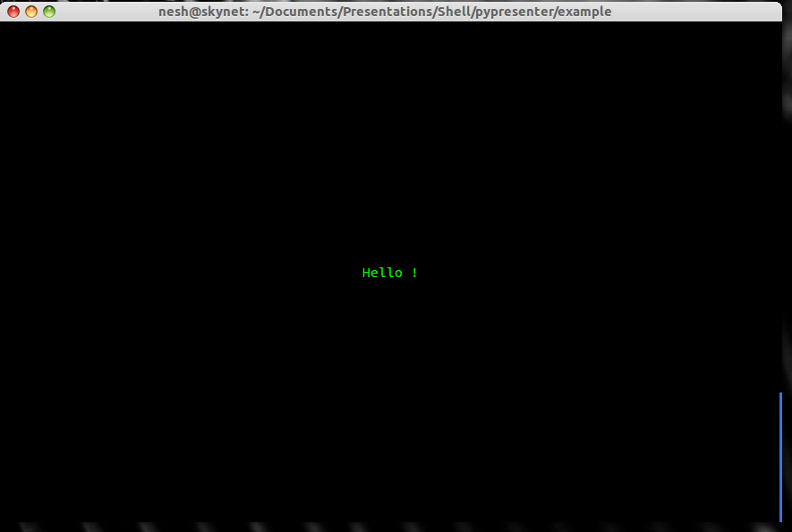
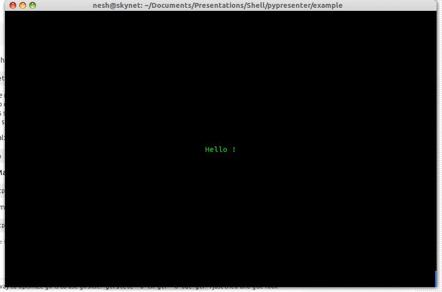
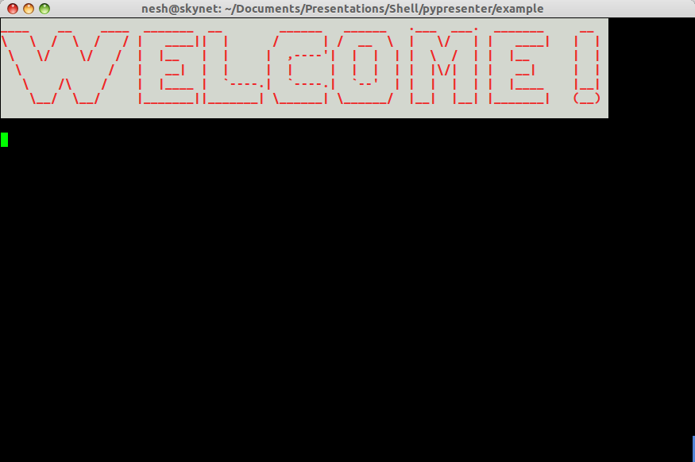
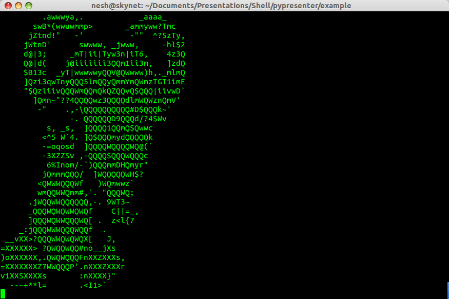
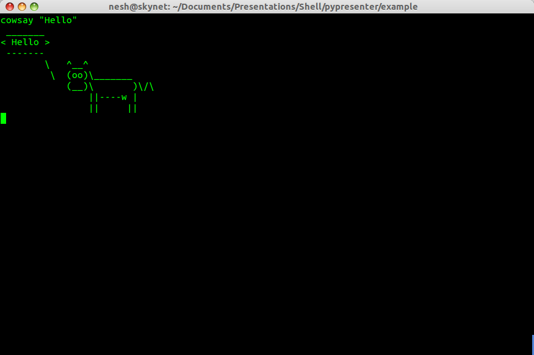

#PyPresenter


##What is It ?

* It is a commandline presentation tool ( Allows you to present on terminal )
* Inspired (to an extent derived) from [Prysenter](https://github.com/cnelsonsic/Prysenter)

## Install

``` bash
$ git clone https://github.com/neshkatrapati/pypresenter.git
$ cd pypresenter
$ sudo python setup.py install
```
or
``` bash
$ pip install pypresenter
```
or
``` bash
$ easy_install pypresenter
```
	
## Usage
``` bash
$ pypresenter example.pypr
(Right Arrow, Left Arrow : Controls)
( Ctrl + C to exit )

```

##Features

###XML format to write slides. 

``` xml
<presentation>
<slide>
	<text>
		Hello !
	</text>
</slide>
</presentation>
```

* Slide center & Text center

``` xml
<slide center="true">
       <center>
		<text>
			Hello !
		</text>
	</center>
</slide>
```



* Text colors, styles and type writing animation
``` xml
<slide center="true">
	<center>
		<text>
			<f style="bold" color="red"> Red Text is </f>
			<typewriter> <f color="blue"> Awesome ! </f></typewriter>
		</text>
	</center>
</slide>
```


* Use figlet 
``` xml
<slide>
	<heading font="starwars" fg="red" bg="white">
		 Welcome !
	</heading>
</slide>
```



* Ascii image rendering using python-aalib
``` xml
<slide>
	<image width="20" height="20"> image.jpg </image>
</slide>
```


* Use os commands in side the slides
``` xml
<slide>
	<command print="true">
		cowsay "Hello"
	</command>
</slide>
```

